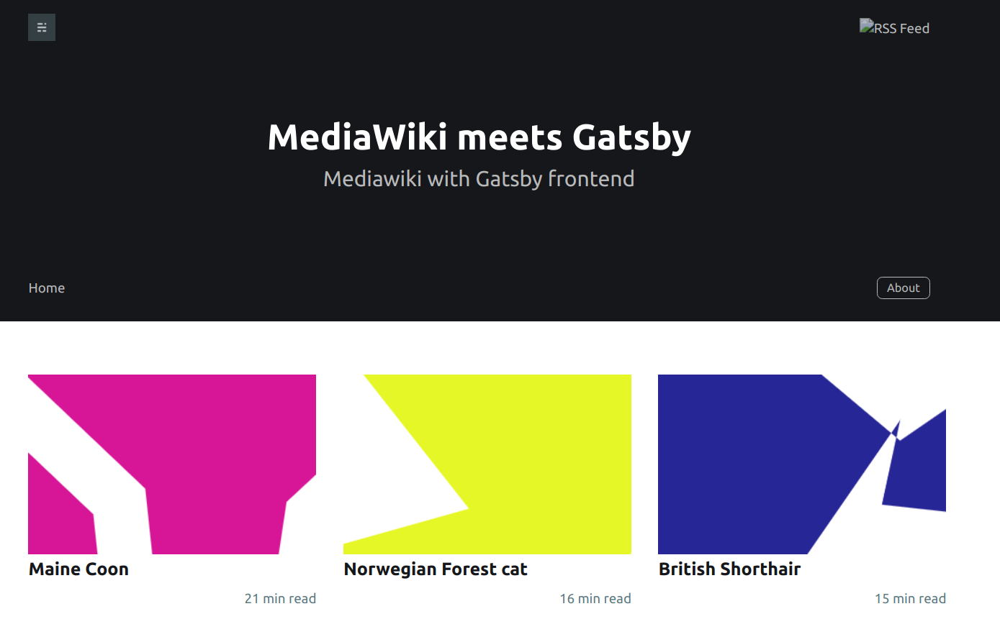

# Gatsby Starter Ghosted Mediawiki

A starter template to interface mediawiki article in a nice gatsby template.



A lot of gatsby-starter-ghost is conveniently reused for its pretty design and well founded architecture, it is not a vanilla Gatsby module for mediawiki.

# Configuration

The default mediawiki backend that is used is wikipedia for demo purposes. You may need to edit `.ghost.json` settings to use your own backend. For example, I use this project to pull a selection of articles I have tagged under the rootCategory [[Category:Featured]] in my private mediawiki instance.

```json
{
  "development": {
    "protocol" : "https",
    "server" : "en.wikipedia.org",
    "path": "/w",
    "debug": true, 
    "userAgent": "Gatsby",
    "title" : "MediaWiki meet Gatsby",
    "description" : "Mediawiki with Gatsby frontend",
    "lang":"FR",
    "timezone":"GMT+2",
    "codeinjection_head":"",
    "codeinjection_foot":"",
    "codeinjection_styles":"",
    "rootCategory": "Linebred_animals",
    "navigation" : [
      {
        "label":"Home",
        "url":"/"
      }
  ]
  }
}

```
